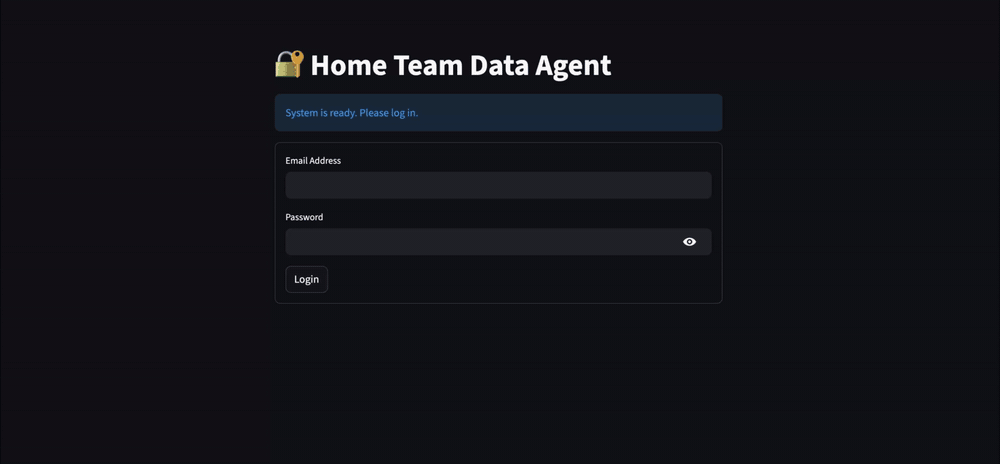
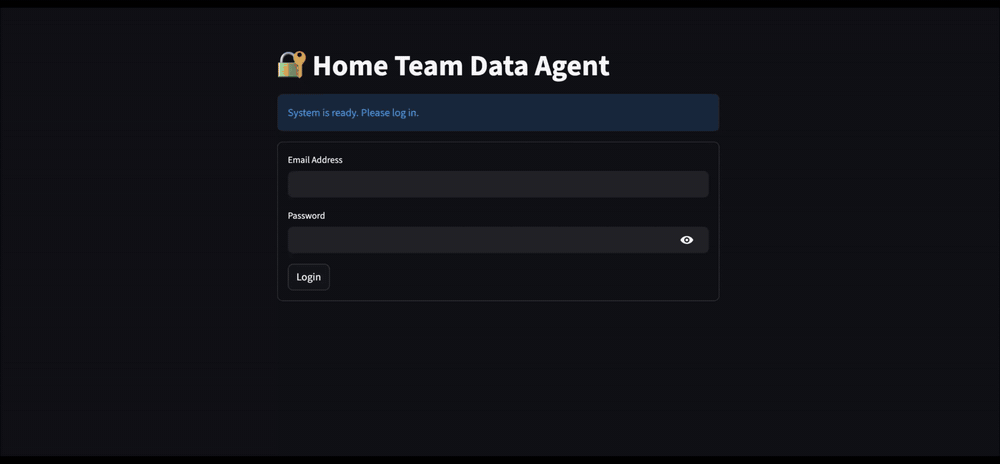

# Agentic Multi-Store RAG (AMS-RAG)

> A unified, agent-routed RAG framework that treats heterogeneous data stores — vector, relational, and graph — as specialised tools instead of a single monolithic index.


---

## Table of Contents

- [Description](#description)
- [Demo](#demo)
- [Key Features](#key-features)
- [Architecture & Methodology](#architecture--methodology)
- [Directory Structure](#directory-structure)
- [Screenshots](#screenshots)
- [Installation](#installation)
- [Usage](#usage)
- [Benchmarking](#benchmarking)
- [Roadmap](#roadmap)
- [Author & Acknowledgements](#author--acknowledgements)
- [License](#license)
- [Project Status](#project-status)

---

## Description

Agentic Multi-Store Retrieval-Augmented Generation (AMS-RAG) is a unified framework designed to overcome the limitations of "one-size-fits-all" RAG systems. While traditional RAG relies on a single vector store, real-world organisational data is heterogeneous — spanning unstructured documents, structured databases, and complex knowledge graphs.

This project implements an **Orchestrator Agent** that acts as an intelligent router, analysing user queries to dynamically select the most appropriate retrieval pipeline. By treating data stores as specialised tools rather than a monolithic index, AMS-RAG delivers accurate retrieval across diverse data formats behind a single conversational interface.

The reference deployment is a **Home Team Unified Agent**, backed by three public-sector datasets (Singapore Police Force, Singapore Prison Service, and HTX) with role-based access control layered on top.

---

## Demo

### 1. Role-Based Access — Officer Tier (Vector Pipeline)

An officer-rank user (`juniorofficer@spf.gov.sg`) signs in and is granted access to the SPF corpus only. Their scam-statistics question is routed to the **Vector pipeline**, which answers from the SPF Annual Crime Reports.



<sub>▶️ [Download the full-resolution recording with audio (MP4, 20s)](https://raw.githubusercontent.com/Joo-ooo/AMS-RAG/main/assets/demo-officer-access.mp4)</sub>

### 2. Multi-Store Routing — Director Tier (Graph + Vector + SQL)

A director-rank user (`director@htx.gov.sg`) is authorised across all three stores (SPF, SPS, HTX). Successive questions in the **same conversation** are routed to different pipelines — an organisational-relationship question to the **Graph pipeline**, then a crime-statistics question to the **Vector pipeline** — with no manual store selection.



<sub>▶️ [Download the full-resolution recording with audio (MP4, 39s)](https://raw.githubusercontent.com/Joo-ooo/AMS-RAG/main/assets/demo-director-multistore.mp4)</sub>

---

## Key Features

- **🤖 Orchestrator Agent** — A central "brain" that classifies user intent and routes queries to the optimal pipeline (Vector, SQL, or Graph), enabling a single interface for diverse data questions.
- **📄 Advanced Vector Pipeline** — Optimised for unstructured text and visual data (PDFs/images), using Nanonets OCR for layout-aware parsing, hybrid retrieval (semantic + BM25), and cross-encoder re-ranking.
- **🗄️ SQL Pipeline** — Specialised for precise lookup and aggregation over structured tabular data, using `Llama-3.1-8B-Instruct` for Text-to-SQL with Query-Time Table Retrieval (QTTR) to focus context on relevant schemas.
- **🕸️ Graph Pipeline** — Designed for multi-hop reasoning and relationship discovery via Text-to-Cypher generation, grounded by entity disambiguation and schema-aware prompting to prevent hallucinations.
- **🔐 Role-Based Access Control** — Authenticated users are granted tool access by rank, so the agent can only query the stores a user is authorised to see.
- **📊 Comprehensive Benchmarking** — A custom evaluation suite using Ragas for vector metrics and execution-based metrics (DataCompy, CypherMatch) for validating SQL and Graph query accuracy.

---

## Architecture & Methodology

### System Architecture


AMS-RAG operates on a **hub-and-spoke** architecture. The central hub is an **Orchestrator Agent** that intelligently routes user queries to one of three specialised retrieval pipelines ("spokes"), each optimised for a specific data type.

### 🤖 Orchestrator Agent

- **Implementation:** `Agent/agent.py`
- **Logic:** A `LlamaIndex` agent workflow driven by a specialised system prompt acting as the "Chief Data Orchestrator."
- **Routing:** Classifies user intent into three categories — **Crime/Scams** (Vector), **Inmate Statistics** (SQL), or **Project Relationships** (Graph) — and executes the corresponding tool (`spf_vector_tool`, `sps_sql_tool`, `htx_graph_tool`).
- **Key libraries:** `llama_index.core.agent.workflow`, `transformers`.

### 📄 Vector Pipeline (Unstructured Data)

- **Implementation:** `Archive/Refactored Pipelines/Vector Pipeline/vector_pipeline.py`
- **Data source:** Singapore Police Force (SPF) Annual Crime Reports (PDFs).
- **Ingestion:** **Nanonets OCR** (via `transformers` `AutoModelForImageTextToText`) parses complex PDF layouts and tables.
- **Indexing:** Embeddings stored in **ChromaDB** (`multilingual-e5-large`).
- **Retrieval:** **Hybrid search** combining semantic similarity with keyword search (`BM25Retriever`).
- **Refinement:** Results re-ranked with a cross-encoder (`BGE-Reranker-v2-m3`) and expanded using **HyDE** (Hypothetical Document Embeddings) to improve context relevance.

### 🗄️ SQL Pipeline (Structured Data)

- **Implementation:** `Archive/Refactored Pipelines/SQL Pipeline/sql_pipeline.py`
- **Data source:** Singapore Prison Service (SPS) inmate statistics (CSVs).
- **Storage:** CSVs ingested directly into a **PostgreSQL** database.
- **Querying:** A **Text-to-SQL** engine powered by `Llama-3.1-8B-Instruct` served through vLLM.
- **Optimisation:** **Query-Time Table Retrieval (QTTR)** dynamically selects relevant table schemas before generating SQL, reducing token usage and hallucination risk.

### 🕸️ Graph Pipeline (Relationship Data)

- **Implementation:** `Archive/Refactored Pipelines/Graph Pipeline/graph_pipeline.py`
- **Data source:** HTX Annual Report (complex entity relationships).
- **Storage:** **Neo4j** graph database.
- **Indexing:** Builds a property graph using `llama_index.core.PropertyGraphIndex`.
- **Querying:** **Text-to-Cypher** generation to traverse relationships (e.g. matching "Projects" to "Departments").
- **Robustness:** A custom `parse_cypher_query` regex utility sanitises LLM output to ensure valid Cypher execution.

---

## Directory Structure

The repository is organised into three main directories: **Agent** for the active application, **Datasets** for data management, and **Archive** for development history and benchmarks.

```plaintext
├── Agent/                      # Unified pipeline and web interface
│   ├── app.py                  # Streamlit web application (auth + chat UI)
│   └── agent.py                # Orchestrator agent pipeline
│
├── Datasets/                   # Data sources for RAG pipelines and evaluation
│   ├── Vector_Dataset/         # Unstructured documents for the Vector pipeline
│   ├── SQL_Dataset/            # Structured data (CSV files) for the SQL pipeline
│   ├── Graph_Dataset/          # Knowledge graph source data for the Graph pipeline
│   └── Benchmark Dataset/      # Evaluation datasets for pipeline performance testing
│
├── Archive/                    # Development artifacts, reports, and previous iterations
│   ├── Base Pipelines/         # Initial notebook implementations (Vector, SQL, Graph)
│   ├── Advanced Pipelines/     # Fine-tuned notebook versions of the base pipelines
│   ├── Refactored Pipelines/   # Pipelines refactored into modular Python classes
│   ├── Benchmark Results/      # Evaluation results for all pipeline iterations
│   ├── Agent Evaluation/       # Performance metrics for the orchestrated agent
│   └── Reports/                # Project proposals and progress reports
│
├── assets/                     # Architecture diagram, screenshots, and demo recordings
├── docker-compose.yml          # vLLM, ChromaDB, PostgreSQL, and Streamlit services
└── pyproject.toml              # Project dependencies (managed with uv)
```

> **Note:** The orchestrator imports the refactored pipeline modules dynamically via the `VECTOR_PIPELINE_DIR`, `SQL_PIPELINE_DIR`, and `GRAPH_PIPELINE_DIR` environment variables, so the pipeline files can live outside `Agent/`.

---

## Screenshots

| Authentication | Chat Interface | Authorised Tools |
| :--- | :--- | :--- |
|  |  |  |

---

## Installation

**Requirements**

- Python **3.11+** (see `.python-version`)
- Docker and Docker Compose
- An NVIDIA GPU with sufficient VRAM for `Llama-3.1-8B-Instruct` via vLLM
- A running **Neo4j** instance for the Graph pipeline
- A Hugging Face token with access to the gated Llama-3.1 weights

### 1. Clone the repository

```bash
git clone https://github.com/Joo-ooo/AMS-RAG.git
cd AMS-RAG
```

### 2. Install dependencies

Dependencies are managed with [uv](https://docs.astral.sh/uv/):

```bash
uv sync
```

### 3. Configure the environment

Create a `.env` file in the project root:

```dotenv
# --- Model access ---
HUGGINGFACE_TOKEN="hf_..."
OPENAI_API_KEY="sk-..."            # Optional: only for hosted-LLM comparisons

# --- Local model / LLM serving ---
VLLM_API_BASE="http://localhost:8001/v1"
NANONETS_OCR_S_DIR="/path/to/nanonets-ocr-s"
MULTILINGUAL_E5_LARGE_DIR="/path/to/multilingual-e5-large"
BGE_RERANKER_V2_M_DIR="/path/to/bge-reranker-v2-m3"

# --- PostgreSQL (SQL pipeline + auth) ---
POSTGRES_HOST="localhost"
POSTGRES_PORT="5432"
POSTGRES_USER="postgres"
POSTGRES_PASSWORD="password"
POSTGRES_DB="sps_statistics"       # Structured dataset (POSTGRES_SQL_DB in docker-compose.yml)
POSTGRES_AUTH_DB="auth"            # User accounts and access tiers

# --- Neo4j (Graph pipeline) ---
NEO4J_URI="bolt://localhost:7687"
NEO4J_PASSWORD="password"
NEO4J_DATABASE="neo4j"
GRAPH_DATASET_DIR="./Datasets/Graph_Dataset"

# --- Pipeline module locations (imported dynamically by Agent/agent.py) ---
VECTOR_PIPELINE_DIR="./Archive/Refactored Pipelines/Vector Pipeline"
SQL_PIPELINE_DIR="./Archive/Refactored Pipelines/SQL Pipeline"
GRAPH_PIPELINE_DIR="./Archive/Refactored Pipelines/Graph Pipeline"
```

### 4. Initialise the data stores

Ensure your Neo4j instance is running, then populate the Vector, SQL, and Graph stores by starting the ingestion process either through the Streamlit UI (`Agent/app.py`) or by running the orchestrator directly:

```bash
uv run python Agent/agent.py
```

---

## Usage

The system is containerised for deployment. To launch the databases, LLM server, and web interface together:

```bash
docker compose up
```

This starts all required services:

| Service | Port | Purpose |
| :--- | :--- | :--- |
| `vllm` | 8001 | Local LLM inference (`Llama-3.1-8B-Instruct`) |
| `chroma-server` | 8000 | ChromaDB vector store |
| `postgres-db` | 5432 | PostgreSQL for structured data and auth |
| `streamlit-app` | 8501 | Streamlit web application |

> The vLLM container needs several minutes to load model weights into VRAM on first start (`start_period: 300s`). The Streamlit app will report "System is ready" once dependencies are healthy.

Once running, open **http://localhost:8501**, sign in, and ask questions such as:

| Pipeline | Example query |
| :--- | :--- |
| **Vector** | "Which scam type had the highest number of cases in 2020?" |
| **SQL** | "What was the total inmate population in 2021 by offence type?" |
| **Graph** | "What is HTX and who does it serve?" |

The answers you receive depend on your access tier — see the [Demo](#demo) section above for the officer-tier and director-tier walkthroughs.

---

## Benchmarking

Each pipeline iteration (base → advanced → refactored → agent) was evaluated with a dedicated metric set:

| Pipeline | Metrics | Tooling |
| :--- | :--- | :--- |
| Vector | Faithfulness, answer relevancy, context precision/recall | [Ragas](https://docs.ragas.io/) |
| SQL | Execution accuracy (result-set equivalence) | [DataCompy](https://capitalone.github.io/datacompy/) |
| Graph | Cypher query match / execution equivalence | Custom `CypherMatch` |
| Agent | Routing accuracy and end-to-end answer quality | `Archive/Agent Evaluation/` |

Evaluation datasets live in `Datasets/Benchmark Dataset/`; results are recorded under `Archive/Benchmark Results/`.

---

## Roadmap

For a detailed timeline of completed milestones and upcoming development phases, see the project plan:

**[📅 View Project Gantt Chart](https://docs.google.com/spreadsheets/d/1aQxM0jrjyhOpHAwQIIw-j-bsdkOsPX7a/edit?usp=sharing&ouid=103044922105855395613&rtpof=true&sd=true)**

---

## Author & Acknowledgements

Built by **[Joo-ooo](https://github.com/Joo-ooo)** as a final-year capstone project.

Thanks to the open-source projects this work builds on: [LlamaIndex](https://github.com/run-llama/llama_index), [vLLM](https://github.com/vllm-project/vllm), [ChromaDB](https://github.com/chroma-core/chroma), [Neo4j](https://neo4j.com/), [Nanonets OCR](https://huggingface.co/nanonets/Nanonets-OCR-s), and [Ragas](https://github.com/explodinggradients/ragas).

Datasets are derived from publicly available Singapore Police Force, Singapore Prison Service, and HTX annual reports and statistics.

---

## License

No license has been declared for this repository yet. Until one is added, all rights are reserved by the author — please open an issue if you would like to reuse this work.

---

## Project Status

This project is complete as a capstone deliverable and is maintained on a best-effort basis. Issues and pull requests are welcome, though responses may be delayed. If you would like to extend the framework, feel free to fork it.
